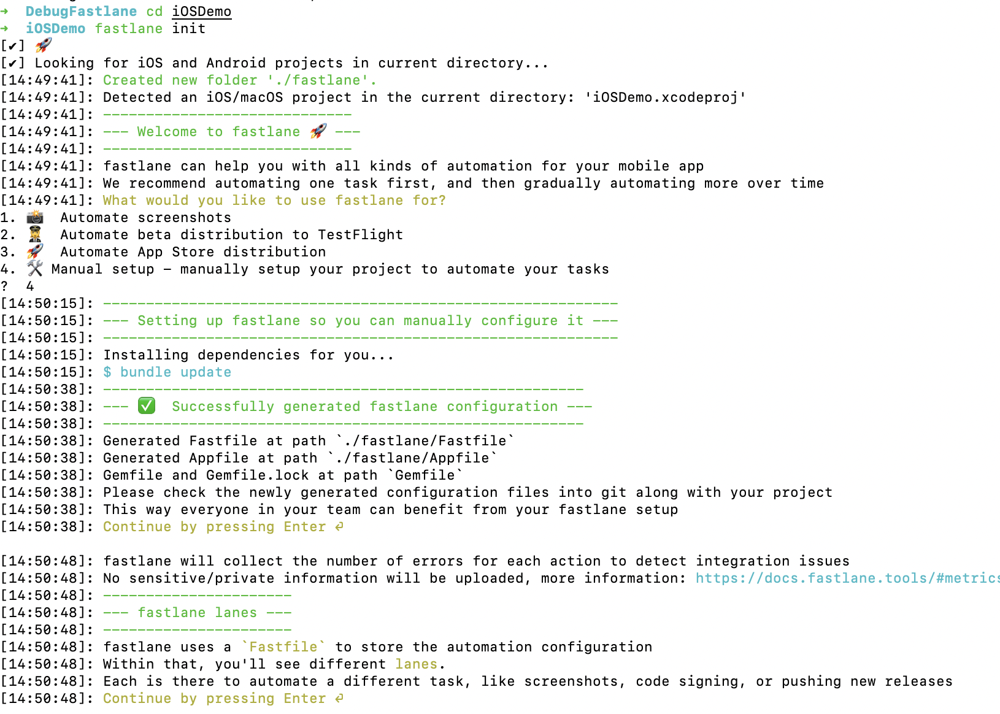
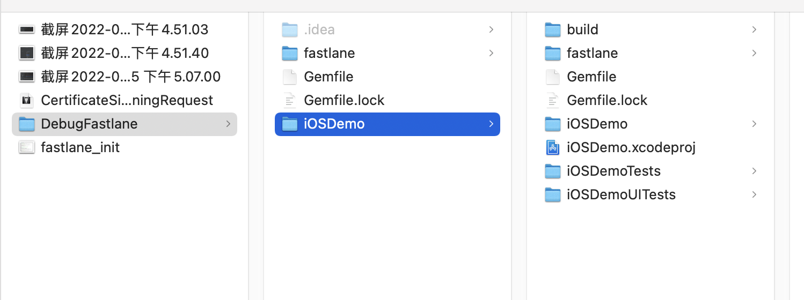
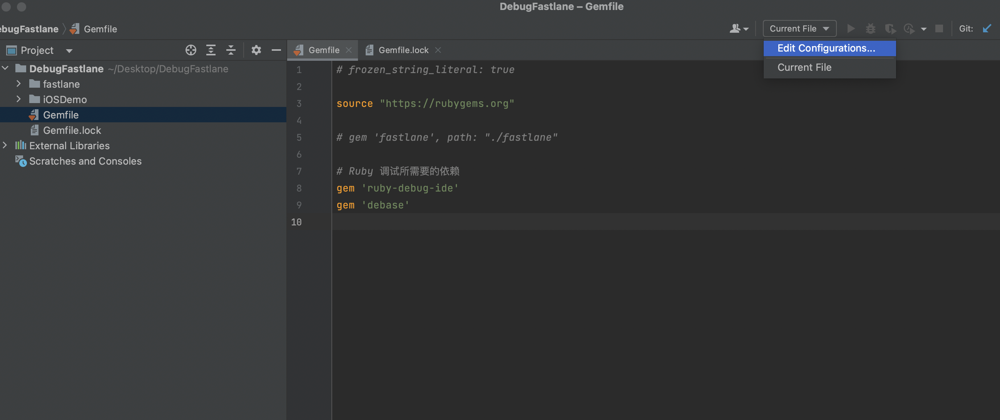
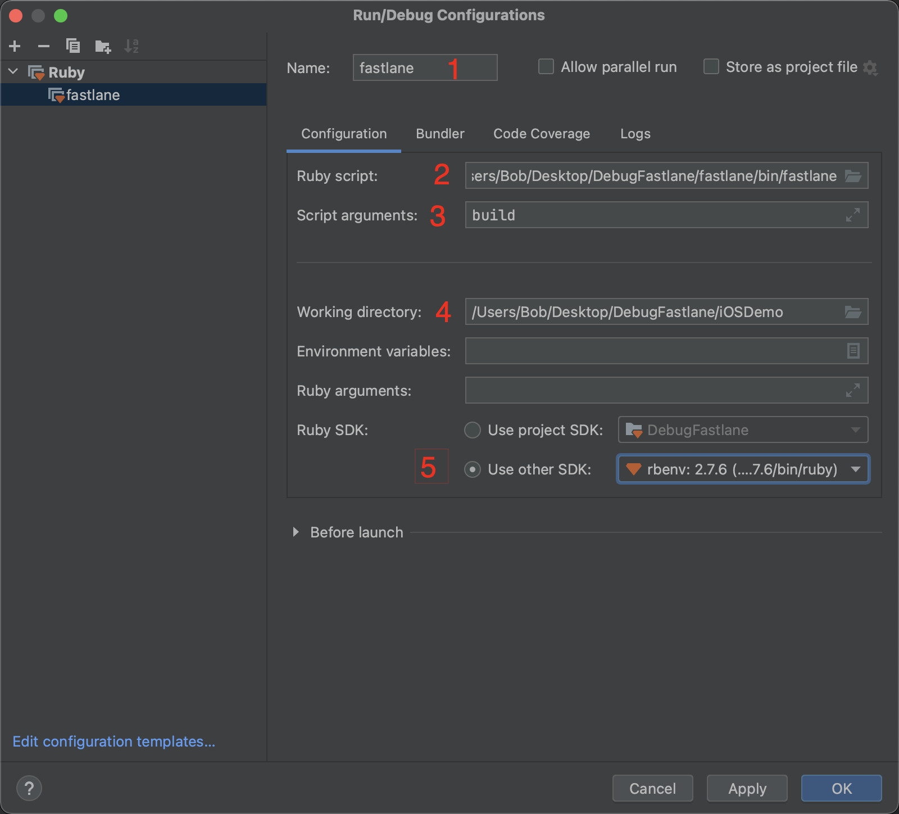
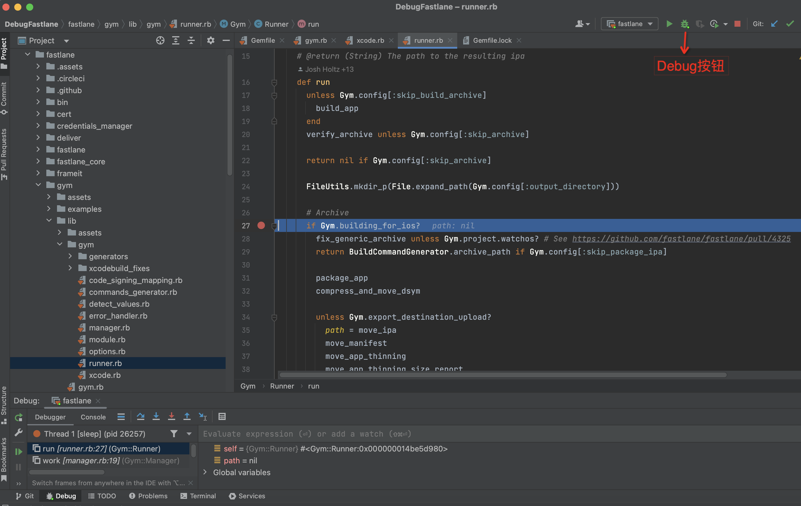
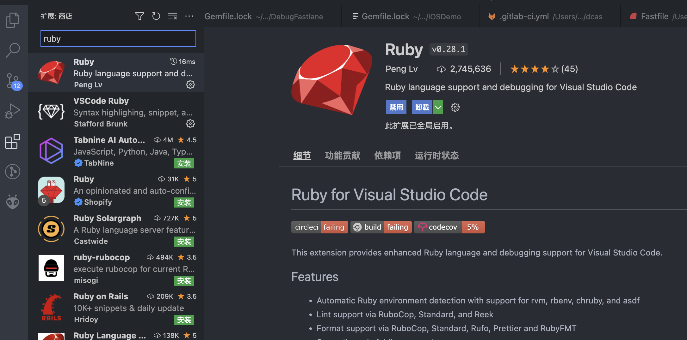
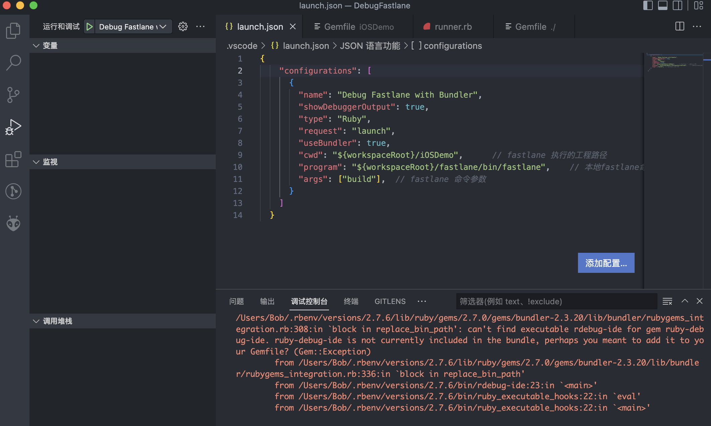
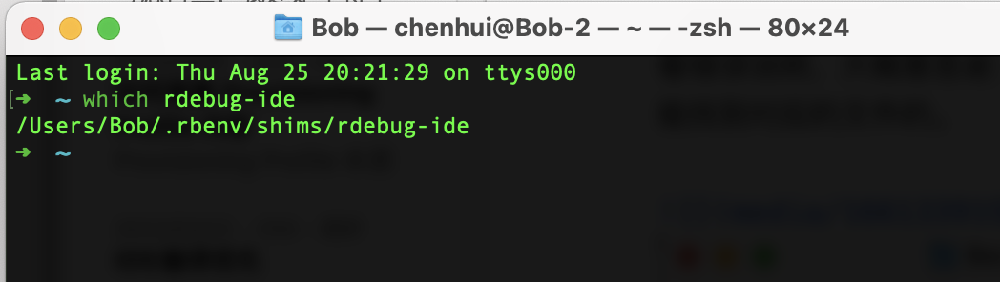
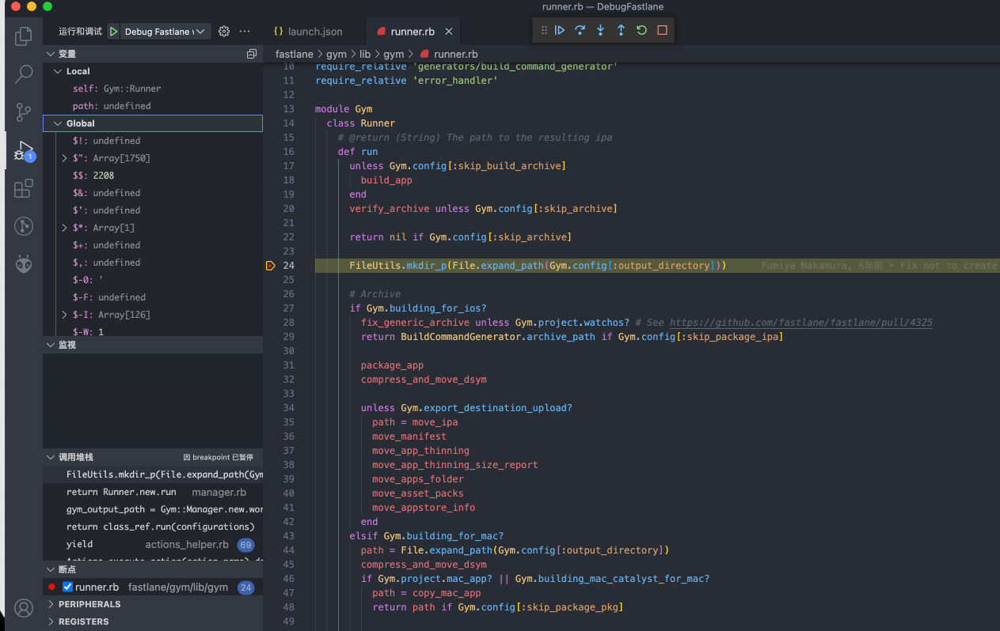

# 如何调试 fastlane 源码

做iOS开发的同学相信基本上都用过 [fastlane](https://github.com/fastlane/fastlane)，使用 [fastlane](https://github.com/fastlane/fastlane) 可以简化我们的开发和发布流程，例如自动化同步开发证书和描述文件([fastlane match](https://docs.fastlane.tools/actions/match/))和一键打包以及同步上传安装包到AppStore([iOS App Store deployment using fastlane](https://docs.fastlane.tools/getting-started/ios/appstore-deployment/))等等。

如果想要深入的了解 fastlane 的工作流程，硬着头皮直接读源码，往往会比较低效。高效的做法是打断点一步步调试，来逐步了解整个流程。

下面我将详细的介绍 fastlane 调试的整个流程。

## 一、环境配置

### Ruby

由于 fastlane 是使用 [Ruby](https://github.com/ruby/ruby) 来实现的，所以我们需要配置好 ruby 环境，我这边是使用的 ruby 2.7.6 版本。macOS 系统是自带有 Ruby 环境的，但是使用系统自带的 Ruby 经常会碰到各种问题，如比较常见的问题：[You don't have write permissions for the /Library/Ruby/Gems/2.3.0 directory.](https://stackoverflow.com/questions/51126403/you-dont-have-write-permissions-for-the-library-ruby-gems-2-3-0-directory-ma)，这里我们不做详细探讨，想要了解背后的原因，强烈推荐阅读这篇文章：[为什么我们要使用 RVM / Bundler ？](https://juejin.cn/post/6844903745822670861)。

我个人推荐使用 [rbenv](https://github.com/rbenv/rbenv) 来管理和切换 Ruby 版本，可以根据官方的 [安装教程](https://github.com/rbenv/rbenv#installation) 来安装 rbevn，然后使用 rbevn 来指定 Ruby 版本。

```shell
rbenv install --list  # 列出所有 ruby 版本
rbenv install 2.7.6   # 安装 2.7.6 版本  
rbenv global 2.7.6    # 全局设置默认版本为 2.7.6
```

查看当前所使用的 Ruby 版本。

```shell
$ rbenv version
2.7.6 (set by /Users/Bob/.rbenv/version)
```

### RubyGems
gem 是 基于Ruby开发的软件包，类似 iOS 中的 framework。

[RubyGems](https://rubygems.org/) 是 Ruby 的一个包管理工具，以及提供了 Ruby 组件的托管服务。当我们使用 `gem install xxx` 时，会通过 [rubygems.org](https://rubygems.org/) 来查询对应的 Gem Package。而 iOS 日常中的很多工具都是 Gem 提供的，例：`Bundler`、`fastlane`、`CocoaPods`等。

### Bundler

在默认情况下 Gem 总是下载 library 的最新版本，这无法确保所安装的 library 版本符合我们预期。因此我们还缺一个gem版本管理工具，这时候 [Bundler](https://bundler.io/) 就横空出世了。

`bundler` 是管理Gem依赖的工具，它通过描述文件 `Gemfile` 来管理一系列依赖，使用命令 `bundle install` 会一键安装所有依赖， 并且生成 `Gemfile.lock` 文件来锁定版本号。可以说 `RubyGems + Bundler` 就相当于iOS 中的 `CocoaPods`。

可以通过如下命令来安装 `bundler`：
```
gem install bundler
```

## 二、工程配置

好了，环境配置好了，我们再配置一下 `fastlane` 源码和Demo工程。
为了便于调试，我把所有需要的文件都配置在一个根目录中。

### 1. 首先，创建一个根目录文件夹，如 `DebugFastlane`。

```shell
# 创建根目录，以及切换到该目录。
mkdir ~/Desktop/DebugFastlane
cd ~/Desktop/DebugFastlane
```

### 2. 下载 fastlane 源码

下载 fastlane 源码到 DebugFastlane 目录下。
```
git clone https://github.com/fastlane/fastlane.git
```

### 3. 创建 iOS Demo工程以及编写 fastlane 脚本

用 Xcode 创建一个iOS工程存放在 DebugFastlane 目录下，当然你也可以 Copy 一个现有的工程到该目录下，假设我们创建的工程名为 iOSDemo。在 iOS工程目录下执行 `fastlane init`命令，输入4来选择手动配置 来初始化 fastlane 运行环境（实际项目中 fastlane 配置远比这复杂，这里只是为了做简单的演示效果）。

```shell
cd iOSDemo
fastlane init

# 输入4选择手动配置，然后一直回车
```

详情如下图所示：



将下面的代码替换 `./iOSDemo/fastlane/Fastfile` 文件里面的内容。我们 Fastfile 文件中只简单的包含一个 build 命令。

```ruby
default_platform(:ios)

platform :ios do
  desc "Build app"
  lane :build do
    build_app(
		scheme: "iOSDemo",
		output_directory: './build',
		clean: true,
		export_method: 'ad-hoc',
		export_xcargs: "-allowProvisioningUpdates",
		include_bitcode: false,
	)
  end
end
```

> 注意：[build_app](https://docs.fastlane.tools/actions/build_app/) 是 gym 的别名。

在 iOSDemo 目录下运行 `fastlane build` 命令看看是否能够正常运行，运行成功的话，会在build目录下生成 `iOSDemo.ipa` 文件和 `iOSDemo.app.dSYM.zip`(符号表)。

### 4. 配置 gem 依赖

回到 DebugFastlane 这个根目录下，运行 `bundle init`，会自动为我们生成 `Gemfile`。

```properties
cd ..
bundle init

# Writing new Gemfile to /Users/Bob/Desktop/DebugFastlane/Gemfile
```

在 `Gemfile` 文件中，输入以下内容，然后执行 `bundle install` 安装调试所需要的依赖。

```ruby
# DebugFastlane 目录下的 Gemfile 文件

source "https://rubygems.org"

# gem 'fastlane', path: "./fastlane"

# Ruby 调试所需要的依赖
gem 'ruby-debug-ide'
gem 'debase'
```

然后，再次回到 iOSDemo 目录，将 `Gemfile` 文件中的 `fastlane` 依赖改成本地依赖，再 运行 `bundle install` 命令。

```ruby
# iOSDemo目录下的 Gemfile 文件

source "https://rubygems.org"

gem "fastlane", path: "../fastlane"
```

最终，我们配置的目录结构如下：




## 三、源码调试

接下来，终于进入了激动人心的源码调试环节了。有两个工具可以调试 ruby 源码，分别为 RubyMine 和 VSCode，下面我会分别对这两个工具进行介绍。具体使用哪个工具，看大家各自的习惯。

### 使用 RubyMine 来调试

[RubyMine](https://www.jetbrains.com/ruby/) 是鼎鼎大名的 Jet Brains开发的 IDE，它有30天的免费试用期，我下载的版本是 RubyMine 2022.2.1。

安装好 RubyMine 后，使用 RubyMine 打开 `DebugFastlane` 这个根目录。
然后，在右上角工具栏选择 `Current File -> Eidg Configurations...`，进入配置页面。



配置如下，下面我们详细解释每一项配置内容：



1. name: 可以随便输入一个名称，如 fastlane。
2. Run script: 运行脚本的路径，这里选择我们本地的 fastlane 源码路径：`~/Desktop/DebugFastlane/fastlane/bin/fastlane`。
3. Script arguments：脚本参数，由于我们只配了一个 `build` 命令，所以这里输入 build。
4. Working directory：工作目录，这里选择我们的 iOS工程目录：iOSDemo。
5. Ruby SDK: Ruby SDK所在目录，这里下拉选择2.7.6版本即可。

接下来，我们在左边Project目录下选择 `fastlane -> gym -> lib -> gym -> runner.rb` 文件，然后在 `run` 方法那里打断点，点击 Debug 按钮就可以开始调试了，效果如下：




### 使用 VSCode 来调试

这里有篇 [使用 VSCode debug CocoaPods 源码和插件](https://github.com/X140Yu/debug_cocoapods_plugins_in_vscode/blob/master/duwo.md) 的文章，我依葫芦画瓢来配置 fastlane 调试。

#### 1. 安装 VSCode Ruby Extention

首先，在 VSCode 扩展中安装 Ruby环境。



#### 2. 配置 VSCode 运行环境

在根目录 `DebugFastlane` 下创建 `.vscode/launch.json` 文件。

```shell
mkdir .vscode
touch .vscode/launch.json
```

在 launch.json 文件中，添加如下运行配置信息：

```json
{
    "configurations": [{
        "name": "Debug Fastlane with Bundler",
        "showDebuggerOutput": true,
        "type": "Ruby",
        "request": "launch",
        "useBundler": true,
        "cwd": "${workspaceRoot}/iOSDemo",      // fastlane 命令执行目录
        "program": "${workspaceRoot}/fastlane/bin/fastlane", // 本地fastlane命令路径
        "args": ["build"]   // fastlane 命令参数
      }
    ]
  }
```

#### 3. 断点和调试

打好断点后，按 F5（或者用菜单：运行 -> 启动调试）来开始调试。然而事情并没有我们想象的那么顺利，直接报错了：



看错误说明，大概意思是 找不到 `ruby-debug-ide`。但是，我运行 `which rdebug-ide` 又是能找到对应的文件的。



后来，我想了下，我是在 iOSDemo 目录下执行 `fastlane build` 来进行调试的，但是 iOSDemo 目录下的 Gemfile 文件并没有添加 `ruby-debug-ide` 依赖。 使用 RubyMine 没有这个问题，大概是因为这个软件内部做了处理了。

```ruby
# iOSDemo 目录下的 Gemfile 文件

source "https://rubygems.org"

gem "fastlane", path: "../fastlane"

# 用 VSCode 调试需要加上下面两句
gem 'ruby-debug-ide'
gem 'debase'
```

再次 `bundle install` 后，重新进行调试，就运行成功了。



最后，本文中所有的代码都可以从这里获取：[DebugFastlane](https://github.com/lexiaoyao20/DebugFastlane)

## 参考资料

* [为什么我们要使用 RVM / Bundler ？](https://juejin.cn/post/6844903745822670861)
* [使用 VSCode debug CocoaPods 源码和插件](https://github.com/X140Yu/debug_cocoapods_plugins_in_vscode/blob/master/duwo.md)
* [版本管理工具及 Ruby 工具链环境](https://mp.weixin.qq.com/s?__biz=MzA5MTM1NTc2Ng%3D%3D&idx=1&mid=2458322728&scene=21&sn=3a16de4b2adae7c57bbfce45858dfe06#wechat_redirect)